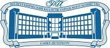

# Матрешка
Верстка bootstrap

<header >

<h1>
Политехнический колледж городского хозяйства</h1>
</header>

<main>
<h1>Магазин сувениров "Матрешка"</h1>

Экзамен по ПМ.08 - РАЗРАБОТКА ДИЗАЙНА ВЕБ-ПРИЛОЖЕНИЙ

Преподаватель: Ильюшенков Леонид Владимирович

Описание проекта: 
<a href="https://github.com/Ilyushenkov/pm08/blob/master/%D1%8D%D0%BA%D0%B7_%D0%9F%D0%9C_08_2025.pdf">Скачать</a>

  
Верстка страниц проекта на bootstrap

  
Сайт проекта: 
<a href="https://ilyushenkov.github.io/pm08/">Посмотреть</a>

</main>
